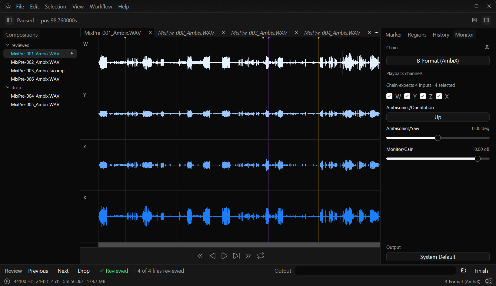

# FieldAssist

Review, edit, and process audio coming in from the field.



> [!WARNING]
> **FieldAssist** is currently in development and incomplete. The
> APIs, feature set, and packaging may change at any time. Development happens
> on `main` so the latest version may not be stable.

- See [docs/BUILDING.md](docs/BUILDING.md) for build, packaging, and app-icon generation.
- See [docs/ARCHITECTURE.md](docs/ARCHITECTURE.md) for the Cargo workspace crate
map and composition patterns.
- See [docs/SCRIPTING.md](docs/SCRIPTING.md) for details on the evolving Lua scripting layer.

Supported formats include WAV, FLAC, MP3, OGG, and M4A (via Symphonia).
Supported platforms include Linux, macOS, and Windows.

Open a file from the app with **File → Open…**, or drag and drop onto the
window. Press Space to play or pause.

## Workspace crates

| Crate                  | Role                                              |
| ---------------------- | ------------------------------------------------- |
| `field-core`           | File URLs and job progress                        |
| `field-audio-model`    | PCM buffers, pager, regions, markers              |
| `field-audio-io`       | Probe, decode, encode                             |
| `field-audio-process`  | Offline peaks and resampling                      |
| `field-audio-monitor`  | Listen-path Faust DSP                             |
| `field-audio-playback` | Realtime playback engine                          |
| `field-ui-components`  | Reusable GPUI widgets and traits                  |
| `field-composition`    | `.facomp` / EDL                                   |
| `field-session`        | `.fasession`                                      |
| `field-scripting`      | Shared Lua 5.4 host                               |
| `field-batch`          | Headless Lua CLI (REPL, scripts, shebang)         |
| `field-play`           | CLI: play a composition on the default device     |
| `FieldAssist`          | Desktop application                               |

### Play a composition from the CLI

```bash
cargo run -p field-play -- path/to/project.facomp
cargo run -p field-play -- path/to/take.wav
```

`field-play` loads a `.facomp`, or builds a composition from a media file,
runs `init.lua` (user config else embedded) and `detect_layout` for the
monitoring chain, then plays on the system default output. Persisted
`monitor_chain` values win; otherwise Direct if detect leaves the chain unset.

### Run a Lua script with field-batch

```bash
cargo run -p field-batch -- path/to/script.lua
cargo run -p field-batch --  # interactive REPL
```

See [docs/SCRIPTING.md](docs/SCRIPTING.md) and
[docs/examples/field-batch/](docs/examples/field-batch/) for scripting details
and samples (including native modules such as lsqlite3).

## License

MIT — see [LICENSE](LICENSE).
