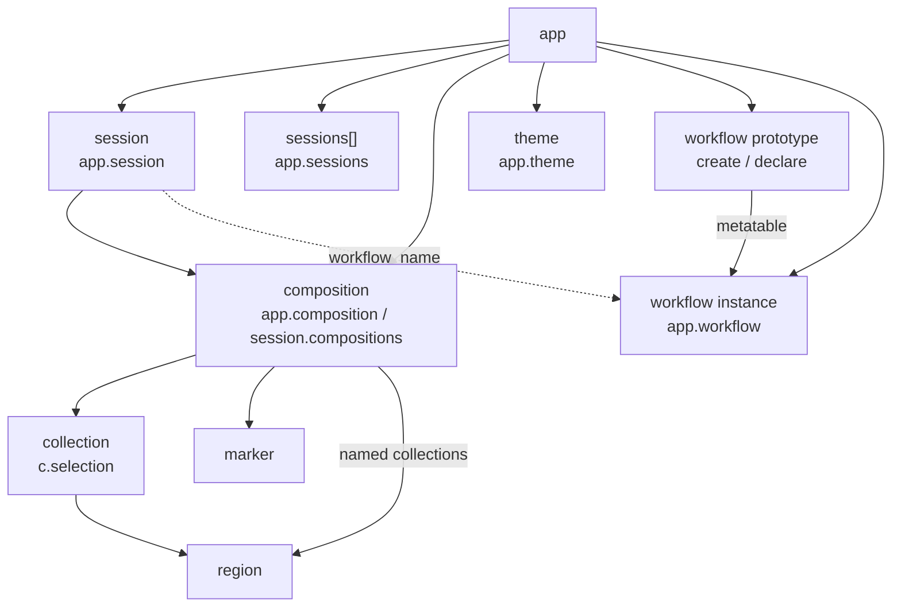

# Scripting

FieldAssist embeds Lua 5.4. Scripts run in the **Script** panel (View → Show
Script) and from files loaded at startup.

## Table of contents

1. [Initilization](#initilization)
2. [Data model](#data-model)
3. [Globals](#globals)
4. [Conventions](#conventions)
5. [app](#app)
6. [session](#session)
7. [composition](#composition)
8. [workflow](#workflow)

## Initilization

Startup loads scripts in this order:

1. Embedded built-in workflows
   * `workflow_add.lua`
   * `workflow_replace.lua`
   * `workflow_review.lua`
2. `init.lua` — the user file in the config directory if it exists, otherwise
   the embedded default
3. User `workflow_*.lua` files next to `init.lua` (sorted by filename)

Config directory for `init.lua` and user workflows:

| OS | Directory |
| --- | --- |
| macOS | `~/Library/Application Support/FieldAssist/` |
| Windows | `%APPDATA%\FieldAssist\` |
| Linux | `$XDG_CONFIG_HOME/FieldAssist/` or `~/.config/FieldAssist/` |

Dump the embedded default with `FieldAssist --dump-init`. A user `init.lua`
**replaces** the embedded default entirely.

Use `init.lua` to register layouts, detect hooks, and pin session-level prefs:

```lua
app.output_device = "Focusrite"   -- substring match; nil = System Default

app:define_layout({
  name = "stereo",
  description = "Left / Right",
  channels = { [0] = "L", [1] = "R" },
  monitor = { chain = "stereo" },
})

app:on("detect_layout", function(c, chosen)
  if chosen then return chosen end
  if c.channels == 1 then return "mono" end
  if c.channels == 2 then return "stereo" end
end)

app:on("loaded", function(c, elapsed)
  app:info("load", string.format("%s in %.0f ms", c.name, elapsed * 1000))
end)
```

## Data model

Scripts see one host global (`app`) and objects reachable from it. The UI
session is always available as `app.session`. Compositions are documents in
that session. A running stateful workflow is `app.workflow` (an instance
table); `session.workflow_name` is the persisted name string.



| Object | How you get it |
| --- | --- |
| `app` | Global |
| `session` | `app.session` (UI-active) or `app:load_session(path)` |
| `composition` | `app.composition`, `app.compositions[i]`, `session:open(path)` |
| `collection` | `c.selection` or `c:collection(name)` |
| `region` | `c.regions[i]`, `collection.regions[i]`, `c:add_region(...)` |
| `marker` | `c.markers[i]`, `c:add_marker(...)`, `c:marker_at(...)`, `c:remove_marker_by_type(...)` |
| workflow prototype | `app:create_workflow({...})` then `app:declare_workflow(...)` |
| workflow instance | `app.workflow` while a stateful run is bound |

Audio and `.facomp` **add** a document. Opening a `.fasession` via
`session:open` (or File → Open) **replaces** the active session.
`app:load_session` loads another session into memory without replacing the UI.

## Globals

Besides Lua’s standard libraries, the host provides one global object and
routes logging through `app`.

| Name | Access | Description |
| --- | --- | --- |
| `app` | global | The running application. Always present. |
| `print(...)` | global function | Writes a line to the Script panel. |

Logging and alerts live on `app` (see [app](#app)):

```lua
print("hello")
app:info("layout", "stereo")
app:warn("load", "slow decode")
app:error("save", "disk full")
app:alert("Cannot replace", "Drop a single file.")
```

`app:info` / `app:warn` / `app:error` write to the Messages tab. If stdout is a
terminal, those lines are also printed in color. Uncaught Lua errors go to the
Script panel.

## Conventions

Times on the timeline are **sample indices** (frames), starting at `0`.
Channel indices are also 0-based.

## app

`app` is the root host object. It exposes the active session, open
compositions, transport chrome flags, theme colors, commands, layouts, and
workflow registration.

**Typical access:** the global `app`.

### Properties

| Property | Access | Description |
| --- | --- | --- |
| `session` | read | UI-active [session](#session). Always present. |
| `sessions` | read | Array: active session plus any `load_session` holds. |
| `composition` | read/write | Focused [composition](#composition), or `nil`. Assign a composition to focus it. Alias of `session.composition`. |
| `compositions` | read | Open compositions in session order (alias of `session.compositions`). |
| `workflow` | read | Running workflow [instance](#workflow), or `nil`. |
| `output_device` | read/write | Session output device name, or `nil` for System Default. Substring / index match like `--output`. Not saved on `.facomp`; set from `init.lua` to persist across launches. |
| `output_devices` | read | Current device names. |
| `theme` | read | Theme colors. See [Theme](#theme). |
| `looping` | read | Transport loop on/off. Prefer `app:command("transport.loop")` to change. |
| `preview` | read | Status-bar Preview on/off. Prefer `app:command("transport.preview")`. |
| `explorer` | read | Whether the Compositions dock is open. Prefer `view.show-explorer` / `view.hide-explorer`. |

### Methods

| Method | Description |
| --- | --- |
| `open(path)` | Open a file into the active session; returns the composition. Alias of `session:open`. |
| `load_session(path)` | Load a `.fasession` without replacing the UI session. |
| `command(id)` | Run a menu/keymap command by id. Unknown ids error. |
| `dofile(path)` | Execute a Lua file. |
| `find_files(dir [, filter])` | Recursive file list relative to `dir`. See below. |
| `define_layout(spec)` | Register or replace a named channel layout. |
| `create_workflow(props)` | Build a workflow prototype (not registered). |
| `declare_workflow(...)` | Register a prototype, or one-shot `(props, func)`. |
| `run_workflow(name [, payload])` | Look up prototype, new instance, call `:start`. |
| `finish_workflow()` / `cancel_workflow()` | End the running stateful workflow. |
| `info` / `warn` / `error(topic, message)` | Log to Messages. |
| `alert(subject, body)` | Modal dialog. |
| `on(event, callback)` | Register a host hook. |

### Examples

Open a file and focus it:

```lua
local c = app:open("/path/to/take.wav")
app.composition = c
```

Walk a folder for media:

```lua
local paths = app:find_files(dir, { "wav", "flac", "facomp" })
-- or: app:find_files(dir, function(dirname, basename)
--   return basename:match("%.txt$") ~= nil
-- end)
```

`find_files` returns paths relative to `dir` with `/` separators. Directories
and symlinks are skipped. A non-directory `dir` is an error. Extension filters
accept `"wav"` or `".WAV"`. The predicate receives `dirname` (parent relative
to `dir`, empty at the walk root) and `basename`.

Run a command and register hooks:

```lua
app:command("edit.trim")

app:on("loaded", function(c, elapsed) ... end)          -- composition, seconds
app:on("saved", function(c, elapsed) ... end)
app:on("session_loaded", function(s) ... end)
app:on("session_saved", function(s) ... end)
app:on("detect_layout", function(c, chosen)             -- return layout name or nil
  return chosen or (c.channels == 2 and "stereo")
end)
```

Hooks run in registration order. For `detect_layout`, the last non-nil
**defined** layout name wins. `chosen` is the persisted user-explicit name or
`nil`.

### Theme

`app.theme.named` and `app.theme.semantic` are live GPUI colors as
`{ r, g, b, a }` tables (`0..1`). Unknown names error. Values are read when
accessed, so `declare_workflow` snapshots `drop.color` at registration.

**Named:** `red`, `red_light`, `green`, `green_light`, `blue`, `blue_light`,
`yellow`, `yellow_light`, `magenta`, `magenta_light`, `cyan`, `cyan_light`.

**Semantic:** `accent`, `accent_foreground`, `background`, `border`, `danger`,
`danger_active`, `danger_foreground`, `danger_hover`, `drop_target`,
`foreground`, `info`, `info_active`, `info_foreground`, `info_hover`, `input`,
`link`, `link_active`, `link_hover`, `muted`, `muted_foreground`, `popover`,
`popover_foreground`, `primary`, `primary_active`, `primary_foreground`,
`primary_hover`, `ring`, `secondary`, `secondary_active`,
`secondary_foreground`, `secondary_hover`, `selection`, `success`,
`success_active`, `success_foreground`, `success_hover`, `warning`,
`warning_active`, `warning_foreground`, `warning_hover`, `chart_1` …
`chart_5`, `chart_bullish`, `chart_bearish`.

### Layouts

`define_layout` registers a named layout. Channel keys are 0-based. Optional
`monitor = { chain = "..." }` sets the default Monitor-tab DSP
(`"mono"`, `"stereo"`, `"ms"`, `"foa"`, `"foa_fuma"`). Detecting a layout only
fills `c.monitor_chain` when it is still unset.

Embedded defaults: `mono`, `stereo`, `MS`, `B-Format (AmbiX)`,
`B-Format (FuMa)`, `2OA`. After honoring persisted `chosen` (`"1OA"` remaps to
`B-Format (AmbiX)`), detection uses basename keywords (`fuma` before `ambix`
when `n >= 4`) then channel-count fallbacks (`1`, `2`, `4`, `9`).

### Commands

`app:command(id)` runs the same actions as menus and key bindings.

**File:** `file.open`, `file.save`, `file.save_as`, `file.save_session`,
`file.save_session_as`, `file.close`, `file.render`, `file.quit`

**Help:** `help.about`

**View:** `view.fit_all`, `view.frame`, `view.zoom_in`, `view.zoom_out`,
`view.show-explorer`, `view.hide-explorer`, `view.toggle-explorer`,
`view.show-detail`, `view.hide-detail`, `view.toggle-detail`,
`view.show-script`, `view.hide-script`, `view.toggle-script`

Show and hide are idempotent. Menus use the toggle variants.

**Transport:** `transport.home`, `transport.previous`, `transport.start`,
`transport.play_pause`, `transport.stop`, `transport.next`, `transport.end`,
`transport.loop`, `transport.preview`

**Edit:** `edit.undo`, `edit.redo`, `edit.cut`, `edit.copy`, `edit.paste`,
`edit.clear`, `edit.remove`, `edit.duplicate`, `edit.trim`, `edit.break_out`

**Selection / markers:** `selection.select_all`, `selection.select_none`,
`selection.invert`, `selection.marker_type_blue`, `selection.marker_type_yellow`,
`selection.marker_type_purple`, `selection.snap_to_marker`,
`selection.add_at_hover`, `selection.add_marker`, `selection.delete_marker`

Marker commands use the active marker type from the Selection menu. Prefer
`c:add_marker` / `c:remove_marker` when the script chooses frame and type.

## session

A session holds an ordered list of compositions, optional grouping metadata,
and the bound stateful workflow name. `.fasession` files persist this
(membership, `group` / `state` / `properties`, `workflow`). Composition audio
edits live in `.facomp`, not the session file.

**Typical access:** `app.session` (UI-active). `app:load_session(path)` returns
a detached session for scripts; `open` / `save` / `save_as` / setting
`composition` are only available on the UI session.

### Properties

| Property | Access | Description |
| --- | --- | --- |
| `id` | read | Session UUID. |
| `path` | read | `.fasession` path, or `nil` until saved. |
| `workflow_name` | read/write | Persisted stateful workflow name, or `nil`. Host sets this from `instance:name()` after `:start`. Prefer `app:finish_workflow()` / `app:cancel_workflow()` to clear. The running instance is `app.workflow`, not this field. |
| `capture_ui` | read/write | Whether UI chrome is captured with the session. |
| `properties` | read/write | String→string map (`nil` values rejected). Snapshot on read. |
| `composition` | read/write | Focused composition, or `nil` (UI session only for write). |
| `compositions` | read | Compositions in order. |
| `groups` | read/write | Ordered named explorer groups (may be empty of members). Assigning a string list replaces the registry; documents whose group is dropped become ungrouped. |

### Methods

| Method | Description |
| --- | --- |
| `group_count(name)` | Documents whose `group` equals `name`. |
| `add_group(name)` | Append a named group (no-op if empty or duplicate). |
| `rename_group(old, new)` | Rename a registry group and all member documents. |
| `delete_group(name)` | Remove a registry group; members become ungrouped. |
| `move_group(name, index)` | Place `name` at 1-based `groups[index]`. |
| `move(doc, index)` | Place `doc` at 1-based `compositions[index]` (`1 .. #compositions`). |
| `open(path)` | Audio/`.facomp` → add; `.fasession` → replace UI session. |
| `save()` / `save_as(path)` | Persist the UI session. |
| `close()` | Drop a Lua-held (`load_session`) session; cannot close the UI session. |

### Examples

Session metadata and grouping:

```lua
local s = app.session
s.properties = { batch = "2026-09" }
s:add_group("todo")
print(s:group_count("todo"))
s:move(s.compositions[2], 1)
s:move_group("todo", 1)
```

Merge paths from another `.fasession` without replacing the UI:

```lua
local incoming = app:load_session(path)
for _, doc in ipairs(incoming.compositions) do
  if doc.path then app.session:open(doc.path) end
end
incoming:close()
```

## composition

A composition is an open audio / `.facomp` document: timeline, selection,
regions, markers, and layout/monitor fields. Edits and markers live here.

**Typical access:** `app.composition`, `app.compositions[i]`, or `session:open(path)`.

Reading `markers`, `regions`, `collections`, `marker_types`, or `properties`
returns a **snapshot**. Region and Marker objects themselves are live; a
removed region/marker errors on further field access.

### Properties

| Property | Access | Description |
| --- | --- | --- |
| `name` | read/write | Display title. Assigning renames in memory and dirties the composition; on save the name becomes the `.facomp` basename next to `project_path` / `source_path`. |
| `id` | read | Composition UUID (stable across sessions; stored in `.facomp`). |
| `parent` | read | Open parent composition, or `nil` if none / not in this session. |
| `children` | read | Open child compositions (table), in session order. |
| `path` | read | Source or project path, if any. |
| `group` | read/write | Session grouping label; `nil` clears. Not written to `.facomp`. |
| `state` | read/write | Session workflow state; `nil` clears. |
| `properties` | read/write | String→string map on the session (not in `.facomp`). |
| `frames` | read | Timeline length in samples. |
| `sample_rate` | read | Hz. |
| `channels` | read | Channel count. |
| `codec` | read | First media codec, if any. |
| `bit_depth` | read | First media bit depth, if known. |
| `basename` / `dirname` | read | File name / parent when file-backed. |
| `channel_layout` | read/write | Effective layout name; assign a defined name or `nil`. |
| `monitor_chain` | read/write | Monitor DSP id (`"mono"`, `"stereo"`, `"ms"`, `"foa"`, `"foa_fuma"`), or `nil` for 1:1. |
| `playback_channels` | read/write | 0-based channels to the monitor, or `nil` / `"all"`. |
| `duration` | read | Length in seconds. |
| `position` | read/write | Playhead / caret sample. |
| `selection` | read/write | Session selection [collection](#collection). Assign `nil` to clear. |
| `regions` | read | Regions in the selection collection (snapshot). |
| `collections` | read | `"selection"` plus persisted collection names. |
| `markers` | read | User markers, ordered by frame then type (snapshot). |
| `marker_types` | read | `{ name, color }` type registry (snapshot). |

### Methods

| Method | Description |
| --- | --- |
| `save()` | File → Save for this composition. |
| `close()` | File → Close (prompts if unsaved). |
| `replace(path)` | Reload this document from audio/`.facomp` (prompts if unsaved). |
| `select(start, stop [, channels])` | Replace selection with one region. |
| `select_all()` / `clear_selection()` | Full timeline or empty selection. |
| `add_region({...})` | Add a region; returns a Region. |
| `remove_region(id)` | Remove by region id. |
| `collection(name)` | Get or create a named collection. |
| `add_marker_type(name, color)` | Register a marker type. |
| `remove_marker_type(name)` | Remove type and its markers. |
| `add_marker(...)` | Insert a marker; returns Marker or `nil` if type already at frame. |
| `marker_at(frame [, type])` | Lookup at sample. |
| `remove_marker(m)` / `remove_marker_at(frame [, type])` | Delete markers. |
| `remove_marker_by_type(type)` | Delete all markers of `type`; returns count. Type stays registered. |
| `undo()` / `redo()` | History; return whether a step ran. |
| `cut()` / `copy()` / `paste()` | Clipboard over selection spans. |
| `clear()` / `remove()` / `duplicate()` / `trim()` | Same as Edit menu on selection. |
| `break_out()` | Edit → Break Out: each selection span becomes a child composition with a default `N-` / `N.M-` display title. Returns one composition or a list. |

Channel scopes (`select`, `add_region`): omit / `nil` / `"all"`, or `{0, 1}`.

### Examples

Selection and timeline edit:

```lua
local c = app.composition
c:select(0, c.frames - 1)
c:trim()
```

Break out selection spans into child compositions (shares media; saves as a
standalone `.facomp` with a founding Trim):

```lua
local child = c:break_out()
print(child.id, child.parent and child.parent.id)
```

Named region:

```lua
local r = c:add_region({
  start = 0,
  stop = 44100,
  label = "intro",
  collection = "cues",
})
c:remove_region(r.id)
```

Markers (one marker per type per frame; color lives on the type):

```lua
c:add_marker_type("Red", {1, 0, 0, 1})
local m = c:add_marker({ frame = 1000, type = "Yellow", note = "door" })
-- or: c:add_marker(1000)  -- Blue
-- or: c:add_marker(1000, "Purple")
m:remove()
```

Built-in types: `"Blue"` (default), `"Yellow"`, `"Purple"`.

### Collection

| Property | Access | Description |
| --- | --- | --- |
| `name` | read | `"selection"` or a persisted name. |
| `regions` | read | Array of Region. |

`#collection` is the region count. Assigning a named collection to
`c.selection` copies its regions into the session selection. `"selection"` is
not saved in `.facomp`; named collections are.

### Region

| Property | Access | Description |
| --- | --- | --- |
| `id` | read | Integer id. |
| `start` / `stop` | read | Sample bounds (`stop` inclusive). |
| `channels` | read | `"all"` or array of integers. |
| `label` | read | String or `nil`. |
| `collection` | read | Collection name. |

### Marker

| Property | Access | Description |
| --- | --- | --- |
| `id` | read | Integer id. |
| `frame` / `sample` | read | Sample position. |
| `type` | read | Type name (e.g. `"Blue"`). |
| `color` | read | `{ r, g, b, a }` from the type registry. |
| `note` | read | String or `nil`. |

| Method | Description |
| --- | --- |
| `remove()` | Delete this marker; returns whether it still existed. |

## workflow

A **workflow** is a named Lua prototype that can run as a one-shot or stateful
procedure. Built-ins Add, Replace, and Review are embedded; user files are
`workflow_<name>.lua` in the config directory (see [Init](#init)).

**Prototype vs instance.** `create_workflow` builds a prototype table. Rust
stores declared fields on `__base_properties` (userdata) and installs readers
and helpers. `declare_workflow` registers it. Each run creates a **new
instance** (metatable = prototype, then `:init()` if defined) and calls
`:start`. Per-run state and toolbar calls belong on the instance (`self`).

`app:declare_workflow` with an existing `name` replaces the previous
registration. Declaring during an in-progress drag does not rebuild that
gesture’s overlay.

| Kind | Rule |
| --- | --- |
| One-shot | No `:suspend` or `:resume`. Does not bind `session.workflow_name` or `app.workflow`. No toolbar. |
| Stateful | Defines `:suspend` and/or `:resume`. After `:start`, host keeps the instance as `app.workflow` and sets `session.workflow_name` to `instance:name()`. |

**Typical access:**

```lua
local Review = app:create_workflow({ name = "review", scopes = { "menu" } })
-- define Review:start / :suspend / ...
app:declare_workflow(Review)

app:run_workflow("review")                      -- payload { scope = "run" }
app:run_workflow("review", { scope = "menu" })
```

One-shot shorthand (Add / Replace style):

```lua
app:declare_workflow({
  name = "add",
  display_name = "Add",
  scopes = { "drag-drop" },
  drop = { row = 1, priority = 1, color = app.theme.semantic.success },
}, function(payload)
  for _, path in ipairs(payload.paths or {}) do
    app.session:open(path)
  end
end)
```

### Prototype properties (create / declare)

Passed to `create_workflow` / the shorthand:

| Field | Required | Description |
| --- | --- | --- |
| `name` | yes | Registry key; also `instance:name()`. |
| `display_name` | no | UI label; defaults to `name`. |
| `description` | no | Human text. |
| `scopes` | yes | List including `"drag-drop"` and/or `"menu"`. |
| `drop` | no | `{ row, priority, color }` for the drop overlay. Defaults: row `1`, priority `1`. |

### Prototype / instance methods

Installed by Rust on the prototype (inherited by instances):

| Method | Description |
| --- | --- |
| `name()` / `display_name()` / `description()` / `scopes()` | Readers from `__base_properties`. |
| `on("command", handler)` | Workflow-local command callback; `handler(self, command)`. Last wins. |
| `set_toolbar(items)` | Install toolbar rows (`nil` clears). |
| `set_item(id, props)` | Merge fields onto an existing row (keeps callbacks). |

Defined in Lua (optional unless noted):

| Method | Description |
| --- | --- |
| `init()` | Called when an instance is created. |
| `start(payload)` | Entry point. Payload has `scope` and optional `paths`. |
| `suspend(session)` | Before save session / quit; return `false` to abort. |
| `resume(session)` | New instance after session load when `session.workflow_name` matches. |
| `finish(session)` / `cancel(session)` | After `app:finish_workflow` / `app:cancel_workflow`. |

### Start payloads

| Source | Payload |
| --- | --- |
| Drop overlay | `{ scope = "drag-drop", paths = { ... } }` |
| Workflow menu | `{ scope = "menu" }` |
| `app:run_workflow(name)` | `{ scope = "run" }` |

### Toolbar items

`align` is `"left"` or `"right"` (default `"left"`). The bar shows
`display_name`, left items, a spacer, then right items.

| `kind` | Fields |
| --- | --- |
| `button` (or omit when `command` set) | `command`, `label` (defaults to `command`), optional `id` |
| `path` | `id`, optional `label`, `value`, `browse` (`"file"` / `"directory"` / `false`), optional `on_path(paths)` → string |
| `toggle` | `id`, `label`, `value`, `on_color`, `off_color`, optional `on_change(current)` → next bool |
| `message` | `id`, `text`, optional `color` |
| `divider` | optional `id` |

Toolbar `command` strings are **not** keymap ids.

### Host behavior

- One stateful workflow per active session. Starting a **different** stateful
  name while one is bound alerts and does not start. Starting the **same**
  name creates a new instance and calls `:start` again.
- One-shot workflows may run while a stateful one is bound.
- Drop overlay: workflows with `"drag-drop"`, laid out once per gesture by
  `drop.row` / `drop.priority` (width = priority / row sum).
- Workflow menu: `"menu"` scopes, sorted by `display_name`; Cancel first.
- Session replace: cancel outgoing, install session, `session_loaded`, then
  new instance + `:resume` if `session.workflow_name` names a stateful prototype.

### Example (stateful sketch)

```lua
local Review = app:create_workflow({
  name = "review",
  display_name = "Review",
  scopes = { "drag-drop", "menu" },
  drop = { row = 2, priority = 1, color = app.theme.semantic.info },
})

function Review:init()
  self.output = ""
end

function Review:start(payload)
  self:set_toolbar({
    { command = "next", label = "Next" },
    { id = "progress", kind = "message", text = "0 of 0" },
    { command = "finish", label = "Finish", align = "right" },
  })
end

Review:on("command", function(self, command)
  if command == "finish" then app:finish_workflow() end
end)

function Review:suspend(session)
  local props = session.properties or {}
  props.output = self.output or ""
  session.properties = props
  return true
end

app:declare_workflow(Review)
```

Built-in **Add** merges audio/`.facomp` and session documents into the current
session. **Replace** replaces the session or the active document. **Review**
is stateful: menu start marks documents `"todo"`; drop expands folders with
`find_files`; toolbar Previous/Next/Drop/Reviewed/Output/Finish; start and
resume enable loop, Preview, and the explorer.
