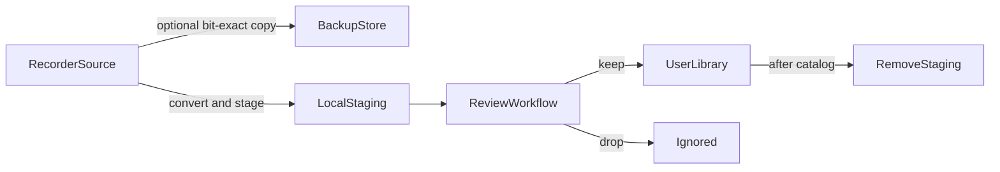

# FieldAssist field-recording pipeline

**Document status:** Draft (reference example; host APIs not shipping)

### Revision history

| Revision | Date | Notes |
| --- | --- | --- |
| 1 | 2026-09-21 | Initial Ingest → Review → Catalog reference |
| 2 | 2026-09-21 | Example Review beside Ingest/Catalog |

This document specifies a **reference end-to-end pipeline** built from three
separate workflows. It is the product vehicle for composing larger jobs under
the one-stateful-workflow-per-session rule, and for listing host capabilities
the current Lua surface lacks.

Related:

- [SPEC-workflows.md](SPEC-workflows.md) — as-built workflow host and Review
- [SPEC-processing.md](SPEC-processing.md) — future processing chains / batch
  export (Catalog’s render path)
- [SPEC-application.md](SPEC-application.md) — session, render, non-destructive
  rule
- [SCRIPT.md](../SCRIPT.md) — as-built Lua API (this file’s intended APIs are
  **not** in SCRIPT until they ship)
- Example scripts: [docs/examples/workflows/field-recording/](../examples/workflows/field-recording/)

## Purpose

Field recordings typically move through three jobs:

1. **Ingest** — get unmodified captures off a recorder (or other source drive),
   optionally back them up bit-exactly, convert and stage copies for review
2. **Review** — keep or drop each staged take (same contract as built-in Review;
   example restates it in the shared pipeline shape)
3. **Catalog** — render kept takes into a library location, then clean staging

Each job is its own named workflow prototype. They do **not** nest and do not
run concurrently. Larger pipelines are modeled by **sequential handoff**:
finish one stateful run, then start the next.

The example Lua under `docs/examples/workflows/field-recording/` is written
against the **intended** host APIs in this document. Those APIs are not
implemented yet; the scripts are a specification aid, not embedded start-up
assets.



## Composition model

| Workflow | Kind | Role |
| --- | --- | --- |
| **Ingest** | stateful | Copy/convert off the source into backup + staging; optional source delete after confirm |
| **Review** | stateful (example + shipping built-in) | Keep / drop on staged session documents |
| **Catalog** | stateful | Process + encode kept items into the library; then remove staging |

### Shared session properties

`session.properties` is already a string→string map on `.fasession`. The
pipeline uses:

| Key | Set by | Meaning |
| --- | --- | --- |
| `ingest_source` | Ingest | Last source root (recorder / drive) |
| `backup_root` | Ingest | Optional bit-exact backup directory (empty = skip backup) |
| `staging_root` | Ingest | Local folder of converted review copies |
| `catalog_root` | Catalog | Destination library directory |
| `output` | Built-in Review only | As-built Review Output path; unused by the pipeline example |

### Job ledger (SQLite sidecar)

Session properties hold user-facing paths. Crash-resume state lives in a
**sidecar SQLite** database (for example next to the `.fasession` or under
`staging_root`), not as a replacement for the session document.

Minimum ledger columns (illustrative):

| Column | Meaning |
| --- | --- |
| `source_url` | Normalized source location |
| `backup_url` | Bit-exact backup location, if any |
| `staging_url` | Converted staging location |
| `source_checksum` / `staging_checksum` | Verification hashes |
| `ingest_status` | pending / backed_up / staged / verified / source_removed / failed |
| `catalog_status` | pending / exported / staging_removed / failed |
| `error` | Last error message, if any |

### Sequential handoff

The host allows only one stateful workflow at a time. Intended primitive
(requirement, not as-built):

```lua
app:finish_workflow({ next = "review" })
-- or :finish returns { next = "review" }
```

The host must **unbind** the current instance first, then construct and
`:start` the next stateful prototype. Until that exists, example scripts end
with a toolbar prompt to start the next stage from the Workflow menu.

## Stage contracts

### Ingest

**Inputs**

- Source: drag-drop paths and/or a toolbar path entry (recorder volume, folder,
  or individual files)
- Optional `backup_root`
- Required `staging_root`
- Preferred staging format (e.g. `flac`)

**Steps**

1. Expand directories with the same media rules as Review (`find_files` for
   readable audio; skip `.fasession`)
2. Optionally **bit-exact copy** each source file into `backup_root` (no
   re-encode). Create intermediate directories as needed
3. **Convert** each source into `staging_root` in the preferred container
   (decode → encode → copy mapped container tags). Preserve relative path
   structure under the staging root when the source was a tree
4. **Verify** backup and staging (size and checksum). Record rows in the
   ledger
5. Optionally **remove source media** from the recorder only after
   `app:confirm(..., { destructive = true })` returns true and verification
   succeeded
6. Open staged files into the session (or leave paths for Review to open) and
   hand off to Review

**Success**

- Every accepted source has a verified staging file
- If backup was requested, every accepted source has a verified bit-exact
  backup
- Source deletion never happens without confirmation and verification

**C2PA (future)**

[Content Credentials](https://c2pa.org/) may be attached to the **staging
derivative** after a successful convert (provenance for the review/catalog
path). The bit-exact **backup** stays unmodified. No Lua signing API is frozen
in this revision beyond that placement rule.

### Review

Same Keep / Drop contract as the shipping built-in
([SPEC-workflows.md](SPEC-workflows.md),
[assets/workflow_review.lua](../../crates/field-assist/assets/workflow_review.lua)).
The pipeline example restates it beside Ingest and Catalog so all three stages
share structure (`shared.lua`, `:persist` / `:restore`, handoff):

[docs/examples/workflows/field-recording/workflow_review.lua](../examples/workflows/field-recording/workflow_review.lua)

- Groups: `todo`, `keep`, `drop`
- No Output path on the example toolbar; Catalog owns `catalog_root`
- Catalog consumes documents with `group == "keep"`
- Review does not delete staging files
- Copying the example into the config directory overrides the embedded `review`
  name (including the built-in’s Output control); omitting it leaves the
  built-in in place

### Catalog

**Inputs**

- Session documents in `keep` (and optionally named regions later)
- `catalog_root` (set on Catalog; not taken from Review)
- Processing chain binding per target or session default
  ([SPEC-processing.md](SPEC-processing.md))

**Steps**

1. For each keep target, apply that target’s processing chain (or the session
   default) and encode into `catalog_root` with captured format settings
2. Update ledger `catalog_status`
3. After all keeps succeed (or after the user accepts partial success),
   `app:confirm` then **remove ingest staging copies** for catalogued items
4. Leave `backup_root` untouched

**Success**

- Every kept item has a library file (or a reported failure)
- Staging cleanup is optional, confirmed, and never touches backup or source
  that was already cleared at ingest

Until processing chains and Lua export ship, the example calls a placeholder
`composition:export(spec)`.

## Intended Lua host surface

These APIs are **requirements** implied by the pipeline. They are not in
[SCRIPT.md](../SCRIPT.md) until implemented. Example scripts call them as if
they exist.

### Progress and confirmation

| API | Role |
| --- | --- |
| Workflow progress | Determinate `{ label, fraction, current, total }` on the bound instance (conceptually the same as Rust `ProgressHandle`) |
| `app:confirm(subject, body [, { destructive = true }])` | Modal yes/no; returns boolean. Distinct from `app:alert`, which cannot answer |
| Background jobs | Copy/convert/export must not block the UI. `:start` returns; host delivers `job_progress` / `job_done` / `job_error` to the instance |
| `app:finish_workflow({ next = name })` | Unbind, then start another stateful prototype |

### Location (`app.url`)

`app.url(native_or_url)` returns a location userdata. Components and helpers:

| Member / method | Meaning |
| --- | --- |
| `scheme` | e.g. `file`, `memory` |
| `native` / `path` | Host-native filesystem path when applicable |
| `normalized` | Canonical `file://…` (or relative form when a base is set) |
| `parent`, `basename`, `stem`, `extension` | Path components |
| `join(...)` | Append path segments |
| `with_extension(ext)` | Replace extension |
| `relative_to(base)` | Relative URL string when inside `base` |

Rust already has `encode_file_url` / `resolve_file_url` in `field-core`; Lua
needs the object and accessors.

### Filesystem (`app.fs`)

| Method | Meaning |
| --- | --- |
| `mkdir(url, { recursive = true })` | Create directories (multi-level) |
| `remove(url [, { recursive }])` | Delete file or tree |
| `copy(src, dest [, { recursive }])` | File or directory copy |
| `exists(url)` | Boolean |
| `stat(url)` | Size, mtime, and related fields |
| `checksum(url [, algorithm])` | Hash for verify (e.g. blake3) |

### SQLite (`app.sqlite`)

| Method | Meaning |
| --- | --- |
| `app.sqlite.open(url)` | Open or create a sidecar DB |
| `db:exec(sql [, params])` | Execute |
| `db:query(sql [, params])` | Rows |
| `db:close()` | Close |

Sidecar only — not a project store replacing `.fasession`.

### Metadata and encode

| Capability | Meaning |
| --- | --- |
| Container tags | Read and write all fields the container supports (WAV INFO / BEXT / iXML, FLAC Vorbis comments, …) |
| Canonical map | Host names such as `created_on`, `created_by`, `location` map to container-specific fields |
| Ingest convert | Decode source → encode preferred format → copy mapped tags. Backup remains `fs.copy` |
| Catalog export | Processing chain then encode; Lua placeholder until SPEC-processing lands: `composition:export(spec)` |
| C2PA | Future hook after staging write; sign the derivative, not the backup |

Encoders today write PCM only (`FormatEncoder::encode` has no tag map). Tag
I/O and C2PA are additive future work.

## Gap table (as-built vs this pipeline)

| Need | Today | Required |
| --- | --- | --- |
| Progress UI | Toolbar `message` text only | Determinate progress on the workflow |
| Confirm before delete | `app:alert` only | `app:confirm` → boolean |
| Non-blocking long work | `:start` runs synchronously | Background jobs + progress events |
| Handoff | Manual Workflow menu | `finish_workflow({ next = … })` |
| URL / path object | Plain strings; `join_path` in Lua | `app.url` with components |
| Create / delete dirs | None | `app.fs.mkdir` / `remove` (recursive) |
| Copy / verify | None | `app.fs.copy` + checksum |
| Crash-resume ledger | Session string properties only | `app.sqlite` sidecar |
| Container metadata | Not exposed | Read/write + canonical names |
| Convert WAV→FLAC | No Lua encode | Decode + encode with tags |
| Catalog render | File → Render UI only; Review `output` unused | Chain + batch / `composition:export` |
| C2PA | None | Staging-derivative credentials |

## Explicitly future

- C2PA / Content Credentials signing API details
- Processing-chain preview and batch export implementation
  ([SPEC-processing.md](SPEC-processing.md))
- Any change to built-in Add / Replace / Review behavior

## Non-goals of this document

- Shipping host bindings in the same change as this spec
- Embedding the example Lua in the application binary
- Replacing `.fasession` with a database
