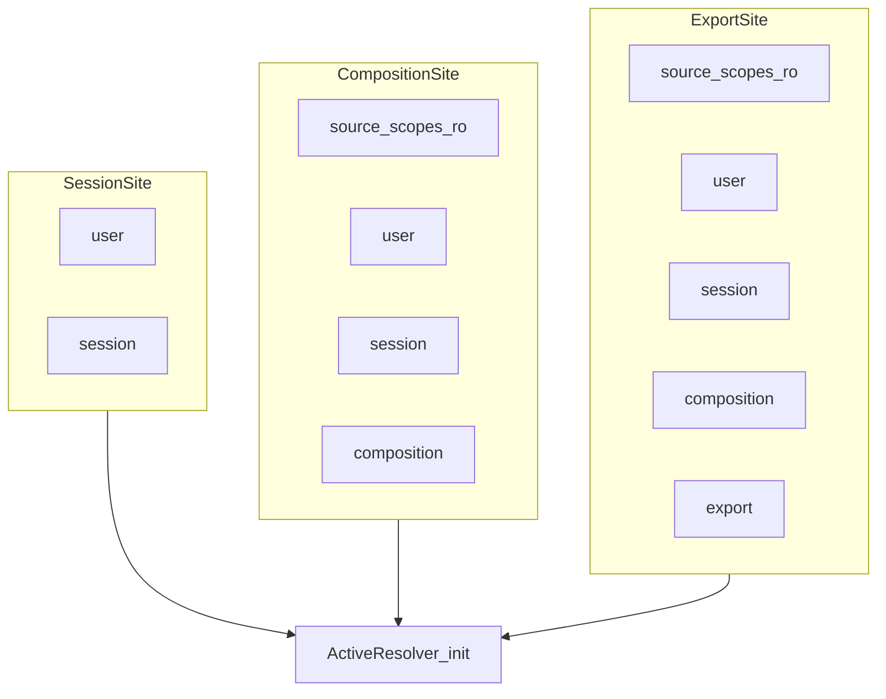

# FieldAssist variables and metadata specification

**Document status:** Provisional

### Revision history

| Revision | Date | Notes |
| --- | --- | --- |
| 1 | 2026-09-26 | As-built variables system; Lua Bindings and resolvers |

This document is the product contract for scoped string variables, source-tag
ingest, export path/tag resolution, and user-extensible Lua resolvers. The Lua
surface is defined in [SCRIPTING.md](../SCRIPTING.md); this file is the design
contract.

Related:

- [SPEC-application.md](SPEC-application.md) — session, composition, UI
- [SPEC-workflows.md](SPEC-workflows.md) — prototype/instance pattern (resolvers
  follow the same shape)
- [SPEC-field-recording.md](SPEC-field-recording.md) — export / catalog intent
- [SCRIPTING.md](../SCRIPTING.md) — API reference
- [ARCHITECTURE.md](../ARCHITECTURE.md) — crate DAG (`field-variables` leaf)

## Purpose

FieldAssist stores and resolves string metadata as **variables**, parallel to
workflow **properties**. Variables drive:

- The Variables dock (composed view for the active composition)
- Export path / filename templates (`${…}`)
- Tags written into exported WAV / FLAC / Ogg

Scripts may replace the default last-wins resolver with aliases, merges, and
computed values (for example `today`).

Workflow `session.properties` / document `properties` are unchanged and remain
workflow state.

## Model

Leaf crate **`field-variables`**:

| Concept | Shape |
| --- | --- |
| Qualified id | `"<scope>[.<sub-scope>…].<name>"`; bare `"<name>"` is a leaf |
| Scope | Everything before the last `.` |
| `VariableEntry` | `{ name, value, description?, scope }` |
| `VariableTable` | Ordered collection keyed by qualified id |

Default compose order (last wins for a given leaf name):

`source` → `user` → `session` → `composition` → `export`

`${var_expression}` interpolation:

- `${title}` — leaf lookup in the resolved table
- `${source.bwf.Originator}` — exact scoped lookup
- Soft (UI): unresolved refs left as-is
- Strict (export): missing refs error

## Persistence

| Scope | Store |
| --- | --- |
| `source` | Derived at media probe (primary media); not user-edited |
| `user` | `variables.json` beside `settings.json` / `init.lua` / `keymap.json` |
| `session` | `.fasession` v3 (`variables` array) |
| `composition` | `.facomp` v10 (`variables` on the project file), plus derived `channel_layout` (layout export `code`, defaulting to layout name) |
| `export` | Export profile Lua tables (`variables = { … }`) |

`variables.json` envelope: `{ "kind": "variables", "format_version": 1, "variables": [ { "name", "value", "description"? } ] }` — entries are implicitly scope `user`.

Resetting settings must not clear user variables.

## Source ingest

On media load / probe ([`field-audio-io`](../../crates/field-audio-io)):

| Sub-scope | Source |
| --- | --- |
| `source` | Technical fields: `basename`, `stem`, `parent`, `sample_rate`, `channels`, `frames`, … |
| `source.riff` | RIFF INFO FOURCCs (`INAM`, `IART`, …) |
| `source.bwf` | BWF `bext` fields (`Description`, `Originator`, …) |
| `source.id3v1` / `source.id3v2` | ID3 frames |
| `source.vorbis` | Vorbis comments (FLAC / Ogg) |
| `source.ixml` | iXML **leaf** tags only (containers such as nested `SPEED` are skipped) |

Primary media only for v1 (first / `FromMedia` initial).

## Export

1. Resolve variables at the **Export** site (see below).
2. Interpolate profile `directory` / `filename` / `path` (strict).
3. Build a tag map from composed leaf values plus profile `metadata` templates.
4. Encoders write tags: WAV INFO / bext / iXML; FLAC / Ogg Vorbis comments.

Unknown encoder keys are skipped; missing tags are omitted.

### Export UI (File → Export)

The sheet Profile row holds Cancel / Export. **Format**, **Location**, and
**Variables** use outlined group boxes. Location includes a read-only **Resolved** path (soft `${…}` interpolate of
Directory + Name). Defaults when the profile omits them: Directory
`${source.parent}`, Name
`${source.stem}-${sample_rate}-${channel_layout}.${export.encoder}`. Variables is
collapsed by default; when open it shows Export-site composed rows with the
same search / Scopes filter as the Variables dock (no add/remove).

Live Format / channel controls upsert these **export**-scope leaves into the
export variable layer (on top of the selected profile’s Lua `variables`):

| Leaf | Value |
| --- | --- |
| `encoder` | Encoder id (`wav`, `flac`, …) |
| `sample_format` | PCM label, or empty when the encoder does not store PCM |
| `sample_rate` | Hz string |
| `channels` | Selected channel count string |
| `extension` | Encoder file extension |

Templates may use `${export.sample_rate}` or a bare name that wins from export.

## UI — Variables dock

Bottom-dock tab shows the **Composition** site resolution for the active
composition. Columns: `#` (fixed), name, value, scope, description (optional).
Editable rows are those whose winning top-level scope is `user`, `session`, or
`composition`. Source-derived rows are read-only.

## Resolvers

Resolution is **user-extensible** via Lua, following the workflow
prototype/instance pattern.

### One prototype, many sites

There is a single **active** resolver prototype for the process. Each
**site** builds a short-lived instance and passes a different Bindings list to
`:init`. The host does not pass a site name; the list *is* the site. Later
entries in the list win for a given leaf name (same order as Rust `compose`).

| Site | Bindings passed to `:init` (order) | Used for |
| --- | --- | --- |
| Session | `user`, then `session` | Session-level resolution |
| Composition | each `source.*` scope from primary media (r/o), then `user`, `session`, `composition` | Variables pane |
| Export | composition list, then profile `export` bindings | Path templates and tag map |

Source is split into one r/o Bindings object per scope path (`source`,
`source.bwf`, `source.ixml`, …) in ingest order, before `user`.

### Lua API (`field.variables`)

| API | Role |
| --- | --- |
| `create_resolver({ name, … })` | Build a prototype (`__base_properties`, `:name()`) |
| `declare_resolver(proto)` | Register by `:name()`; `"default"` replaces the built-in |
| `set_resolver(name)` | Select the active resolver for this process (startup script, not settings) |
| `create_bindings(scope)` | Detached **r/w** Bindings for an arbitrary scope string |

Prototype methods:

| Method | Contract |
| --- | --- |
| `:init(bindings)` | Array of Bindings userdata, host order. Instance is short-lived |
| `:name()` | Registered name |
| `:resolve(scope, name)` | Returns `value, resolved_scope`. `scope == nil` is composed leaf lookup; a string is an exact scope path plus leaf `name`. Unresolved → `nil, nil` |
| `:names()` | Leaf names to materialize (pane rows / export candidates). Required so computed names such as `"today"` appear. Default: union of `bindings:names()` |

Host constructs instances itself and calls `:init(self, bindings)` — do not rely
on a no-arg `new_instance` init.

### Bindings userdata

| Member | Behavior |
| --- | --- |
| `values` | Table-like proxy: leaf name → string (`__index` / `__newindex` / `__pairs`) |
| `:scope()` | Scope string for this Bindings instance |
| `:names()` | Keys of `values` |

- `session.variables` / `composition.variables` — live **r/w** Bindings (writes
  hit the session / `.facomp` store). Assignment still accepts map / row-array
  tables and Bindings userdata. These are **single-scope stores**, not the
  Variables pane view.
- `composition:resolve_variable(name)` / `(scope, name)` — composition **site**
  lookup (`source.*` + user + session + composition), matching the Variables
  pane. Returns `value, resolved_scope` or `nil, nil`.
- Probe / source Bindings — **r/o** (`values[k] = …` errors).
- User and export-profile Bindings — r/w.
- `values` holds strings only; `description` stays on the Rust entry and is not
  part of the proxy.

### Default resolver

Embedded `resolver_default.lua` (loaded **before** `init.lua`, then workflows):

- Declares name `"default"`
- Last-wins across the `:init` list (matches Rust `compose`)
- `:names()` returns the union of binding names

A user `init.lua` may `declare_resolver` with name `"default"` or
`set_resolver("…")` to override. If `init.lua` fails early, `"default"` is
already registered.

Rust `compose` / `interpolate` remain library primitives and the fallback when
no Lua resolver is registered (unit tests, hosts that never loaded scripts).
Fallback compose uses the same per-site lists.

### User resolver examples (not built-in)

- **Alias:** `operator` → first hit among `source.ixml` / `source.id3v2` under a
  differently named leaf.
- **Merge:** `artist` → concatenation of several upstream values.
- **Computed:** `today` → `os.date("%Y-%m-%d")` with resolved scope `"computed"`,
  and `:names()` appending `"today"`.

## Startup load order (FieldAssist)

1. Embedded `resolver_default.lua`
2. User `init.lua` if present, else embedded `init.lua`
3. Embedded `workflow_add.lua`, `workflow_replace.lua`, `workflow_review.lua`
4. User `workflow_*.lua` next to `init.lua`, sorted by path

## Non-goals (v1)

- Multi-media source merge
- Persisting the active resolver name in settings
- Editing `export` or `source` rows in the Variables pane
- Replacing workflow `properties`
