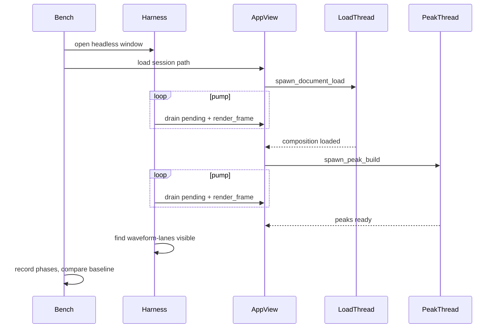

# Headless UI workflow benches

**Status:** deferred. Do not implement this until FieldAssist is split into
multiple crates that isolate concerns and localize tests. The current
binary-only layout (`src/main.rs` owning every module) would force a shallow
`[lib]` extract just to let Cargo benches import `AppView`. That work belongs
in the crate split, not as a one-off for profiling.

This note records the intended design so it can be picked up after that
refactor.

## Goal

Profile named UI flows such as **open session file → waveform peak display
completed**, produce CPU flamegraphs, and keep per-platform baselines so
regressions are detectable.

Measurement environment: GPUI Kit `TestAppContext` (headless), wall-clock
`Instant`. Kit’s testing guide is the right way to **drive** the UI: enable
`test-support`, open the production app view in a headless window,
`render_frame`, and query stable `ElementId`s. It is **not** a GPU profiler.
Kit’s own docs say those tests are not rendering-performance benchmarks;
`wait_for` uses the test executor clock; pixel rendering is macOS/Metal only.
The FPS HUD ([gpui-kit.com/docs/fps](https://gpui-kit.com/docs/fps)) is a live
overlay, not a regression gate.

For “open session → waveform peaks displayed”, time is almost entirely decode,
peak cache build, and first layout. Wall-clock timings on `TestAppContext`
capture that. Wrap the same binary with samply / cargo-flamegraph for CPU
flamegraphs.



## Prerequisite: crate split

Benches are a separate Cargo crate and can only see public library items.
After the refactor:

- The UI crate (or a dedicated testing crate) should expose a small public
  harness API, not the whole application surface.
- Playback, decode, and peak build should be testable without opening a
  window. Workflow benches still boot the real view so they time the
  production path.
- `gpui-kit` `test-support` stays a **dev-dependency** (or a
  testing-crate dependency) so ordinary application builds stay
  uninstrumented. Features unify for benches.

Do not add a temporary `[lib] name = "fieldassist"` on the current package
just to unblock this.

## Headless boot path

`AppView::new` / `PlaybackSession::open` currently require a real cpal output
device. Benches and CI runners often have none.

- Add `PlaybackEngine` / `PlaybackSession` constructors that keep
  `PlaybackShared` but skip opening a `cpal::Stream` (`Option<Stream>` or a
  dedicated `headless()` constructor).
- Public testing entry that:
  - calls `gpui_kit::init`
  - opens a fixed-size window (`1280×760`) wrapping the production app view
    in `Root` (same as `app::run`)
  - does **not** open an output device
- Expose a **synchronous pump**: the same work as the 33 ms loop in
  `AppView::new` (`drain_pending_load`, progress notify, etc.). The bench
  must call this itself. Do not time against that timer, and do **not** use
  `cx.wait_for` — load/peaks use `std::thread::spawn`, and Kit’s wait helper
  advances the fake test clock.

Also expose:

- `load_session_from_path` (today `replace_session_from_path` is private)
- `peaks_ready()` via the active document’s `can_paint_overview()`
- `progress_idle()` so we do not finish while “building peaks” is still
  showing

Mark the existing `"waveform-lanes"` node with `.test_support()` (no-op in
production). Completion is: peaks ready, progress idle, and
`window.find("waveform-lanes")` visible after `render_frame`.

## Shared harness + one directory per flow

Shared runner lives next to the UI crate’s test support so every flow stays
small. Layout:

```
benches/
  open_session_peaks/main.rs    # first flow
  baselines/
    windows-x86_64.json
    macos-aarch64.json
    linux-x86_64.json
```

Later flows are more `[[bench]]` entries, each a directory with `main.rs`.
Cargo does not recurse `benches/*/` as packages; each flow is an explicit
`[[bench]]` with `harness = false`.

```toml
[dev-dependencies]
gpui-kit = { version = "0.6.1", features = ["test-support"] }

[[bench]]
name = "open_session_peaks"
path = "benches/open_session_peaks/main.rs"
harness = false
```

Each flow implements a small trait:

- `name` / fixture setup
- `start(app, window, cx)` — e.g. load the session
- `done(app, window, cx) -> bool` — peaks + visible lanes
- optional named **phases** sampled while pumping (wall clock):
  `session_parsed`, `audio_loaded` (`frames > 0`), `peaks_ready`,
  `lanes_painted`

The runner:

1. Builds `TestAppContext` (public constructor, or the same setup
   `#[gpui_kit::test]` uses if 0.6.1 hides it).
2. One discarded warmup run.
3. N measured runs (default ~5–10) of start → pump until done, each with a
   timeout.
4. Prints median / p95 and per-phase medians.
5. Compares median to the committed baseline for
   `env::consts::{OS, ARCH}`.
6. `--save-baseline` rewrites that JSON. `--once` runs a single measured
   iteration (for flamegraphs). `--ci` fails the process if median exceeds
   baseline by a fixed relative threshold (start at **20%**, ignore missing
   baseline with a warning until the first save).

Do **not** use Criterion for these. They are multi-thread workflow timings,
not microbenchmarks; Criterion’s inner loop fights `std::thread::spawn`,
file I/O, and flamegraph capture.

## Fixture for the first flow

Generate at runtime into a temp dir (no committed WAV):

- Stereo 48 kHz WAV of a fixed length (e.g. 30–60 s of noise or a tone) via
  `hound`.
- A `.fasession` written with `Session::to_json_at` pointing at that WAV.

Same bytes every run (seeded). Size is the workload; keep it large enough
that decode + peaks dominate window setup.

## Flamegraphs

Sampling profilers wrap the **same** bench binary. Add a `debug = 1`
bench/profiling profile so frames resolve without turning off optimizations.

- Linux: `cargo flamegraph --bench open_session_peaks -- --once`
- macOS / Windows: `samply record` on that binary with `--once` (samply is
  the most portable of the three)

Document both in `BUILDING.md`. Output under `target/bench-profiles/`
(gitignored). A small `script/bench-flow` (ps1 + sh) can pass `--once` and
invoke samply when present.

These graphs will show decode, peak-bin build, GPUI layout, and
test-platform paint stubs — not GPU `Window::draw`. That matches the chosen
measurement environment.

## Regression detection

Committed JSON, one file per OS/arch, checked in after a quiet machine run
on each supported platform:

```json
{
  "flow": "open_session_peaks",
  "os": "windows",
  "arch": "x86_64",
  "median_ms": 412.3,
  "p95_ms": 480.1,
  "phases": { "audio_loaded": 180.0, "peaks_ready": 390.0, "lanes_painted": 412.3 }
}
```

CI: GitHub Actions jobs on `macos-latest`, `windows-latest`, and
`ubuntu-latest` that run only this bench
(`cargo bench --bench open_session_peaks -- --ci`). Linux uses Kit’s usual
native deps; `TestAppContext` does not need a display. First landing can
`--save-baseline` on each runner and commit, then subsequent PRs compare.

Expect machine noise; the 20% band is a tripwire, not a micro-regression
detector. Re-save baselines only when an intentional speedup or hardware/CI
image change lands.

## Out of scope (later)

- `gpui-fps` HUD in the shipping app
- VisualTestContext / `render_to_image` (macOS-only in Kit)
- Criterion microbenches of `build_peaks` / `fill_minmax_columns` (useful,
  but a different layer)
- More flows until the first one is green on all three OS jobs
